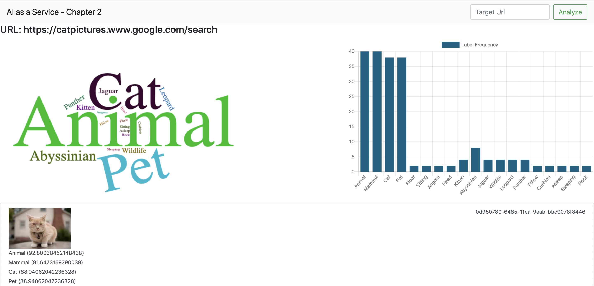
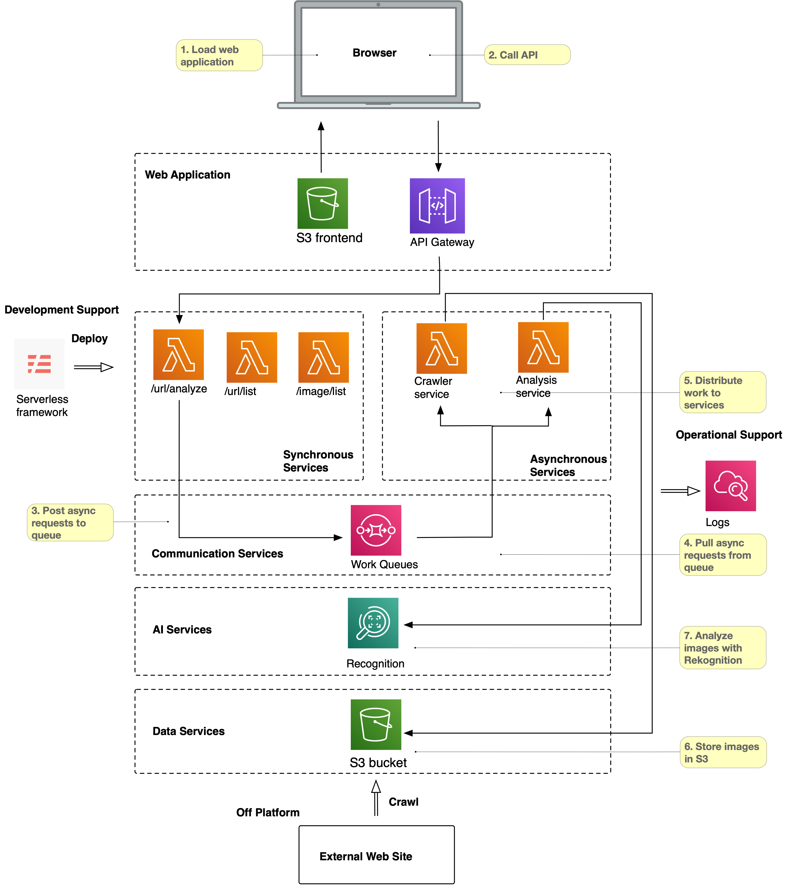

# Cat Detector Step 1 - Overview
In this workshop we are going to deploy our serverless cat detection system (actually it will detect any images). By the end, you will have configured and deployed a small system to AWS that is capable of reading and recognizing images from a web page, and displaying the results for review.

## Workshop Overview
This workshop is divided into the following sections.

### Section 1 - Overview and Setup
* [step1-overview](../step1-overview/README.md) - this explanation
* [step2-setup](../step2-setup/README.md) - ensure that you have the correct tooling ready to go

### Section 2 - Serverless Framework, Infrastructure and AWS Rekogntion
* [step3-serverless](../step3-serverless/README.md) - overview of the serverless framework and other tooling
* [step4-infrastructure](../step4-infrastructure/README.md) - deploy shared infrastructure
* [step5-rekognition](../step5-rekognition/README.md) - an investigation of the capabilities of AWS Rekognition

###  Section 3 - Asynchronous Services
* [step6-crawler](../step6-crawler/README.md) - deploy and test the crawler service
* [step7-analysis](../step7-analysis/README.md) - deploy and test the analysis service

###  Section 4 - UI Deploy and test. Wrap up
* [step8-ui](../step8-ui/README.md) - deploy UI service
* [step9-full](../step9-full/README.md) - deploy the front end and test the system
* [step10-wrapup](../step10-wrapup/README.md) - wrap up and remove deployed resources

## Finished System UI
It's good to have a goal to aim for! The UI for our finished system looks like the following:

## Architecture
The image below depicts the architecture for our cat detector:

Briefly, the system works as follows:

* A single page front end application is served up from an S3 bucket.
* The frontend calls Lambda functions in the UI-service through API gateway.
* Our UI-service provides an API to post messages into an SQS queue as well as APIs for fetching results for display.
* The Crawler and Analyzer services (Lambda functions) are triggered via an SQS queue.
* The Crawler is responsible for fetching images for analysis
* The Analysis function is responsible for running the image recognition tasks using AWS Rekognition

The code for the cat detector is in the `system` directory in this repository.
