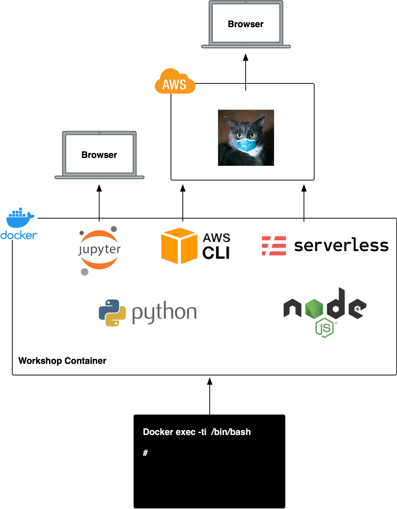

# Cat Detector Step 2 - Setup
For your convenience we have created a docker container that is configured with all of the required software tools for the workshop. The `Dockerfile` for the container can be found in the `/container` directory in this repository. The container has the following installed:

* python 3.7
* Jupyter Labs server
* AWS CLI
* node.js
* serverless framework

If you are already comfortable with using these tools on your development machine then you don't necessarily need the container however we recommend that you use it in order to have the same working environment.

The image below shows how we will work with this container:



We will use the command line to connect to the container. This will allow us to deploy our cat detector system using the tools installed in the container. The container will also serve up Jupyter notebooks that will allow us to run interactive tests against the AWS API and the deployed system.

## Clone this repository
You should clone this repository locally using the following command

```sh
git clone git@github.com:fourTheorem/workshops.git
```

## Setup Docker
If you don't already have docker installed then you will need to set it up. Platform specific instructions can be found here:
[https://docs.docker.com/get-docker]( https://docs.docker.com/get-docker)

## Get the container
We have published the container to docker hub, the quickest way to get the container is to run:

```sh
$ docker pull pelger/aiasaservice
```

This will fetch the container from Docker Hub. Alternatively, the container can be built from source as follows:

```sh
$ cd container
$ docker build -t aiasaservice .
```

It is usually quicker to pull the container than to build it!

## Configure the Container
Once you have the container you will need to configure it. We have provided a template environment file in the `container` directory in this repository. To configure the container `cd` into this directory and copy the file `run.env.template` to `run.env`. Open the file `run.env` in a text editor and change the following lines:

PLEASE ENSURE THAT YOU DON'T PUT IN ANY SPACES EITHER SIDE OF THE EQUALS SIGN!!

```yaml
AWS_ACCESS_KEY_ID=<your access key id>           <-- your AWS access key
AWS_SECRET_ACCESS_KEY=<your secret access key>   <-- your secret access key
AWS_DEFAULT_REGION=eu-west-1
AWS_REGION=eu-west-1
AWS_ACCOUNT_ID=<your account id>                 <-- your AWS account id
MY_CRAWLER_QUEUE=MyCrawlerQueue
MY_ANALYSIS_QUEUE=MyAnalysisQueue
MY_BUCKET_NAME=<your bucket name>                <-- your bucket name
```

Use your specific AWS credentials to configure the file. For the bucket name you will need to pick a globally unique name to avoid a collision. We suggest something like:

```
<your last name><your company name><todays date>
```

For example: `elgerfourtheoremoctober122020`

## Run the Container
We have provided a run script for the container. To start the container:

```sh
$ cd container
$ ./run.sh
```

On windows:

```cmd
c:> cd container
c:> run.cmd
```

This will run the container and give you a command prompt inside the container. You should see output similar to the following:

```sh
.
*******************************************************************************************
Bucket name elgerfourtheoremoctober122020 is available, You're good to go!
*******************************************************************************************
.
.
.
To access the notebook, open this file in a browser:
			file:///root/.local/share/jupyter/runtime/nbserver-28-open.html
	Or copy and paste one of these URLs:
			http://fa153e27d046:8888/?token=4bf8586b7a2b357b0cca12b9586360bfb5fb77bec99fb88b
	 or http://127.0.0.1:8888/?token=4bf8586b7a2b357b0cca12b9586360bfb5fb77bec99fb88b

root@fa153e27d046:/home/dev#
```

## Bucket message
You should see a message similar to the above informing you that the bucket name you chose is available. If so you can skip this bit! However if you get an error message such as:

```sh
*******************************************************************************************
Bucket name wibblefish is already taken, you will need to choose another bucket name :(
*******************************************************************************************
```

You will need to pick another bucket name. To make this easy we have provided a script in the container called `checkbucket.sh` you can use it as follows:

```sh
# cd /home/dev
# ./checkbucket <YOUR BUCKET NAME>
```

Keep trying bucket names until you find one that is available. Once you do you will need to re-configure and restart the container. To exit the container and remove it run:

```sh
# exit
$ docker kill workshop
$ docker rm workshop
```

Next edit the file `run.env` to supply your new bucket name and start the container again as described above.

## Confirm the container is configured correctly
To confirm that your container is correctly configured run the following from the command prompt

```sh
# aws s3 ls s3://
```

This should return a list of all of the buckets on the configured account.

Next copy and paste the url to the notebook from the container output into a browser and check that Jupyter loads correctly. For example:

```
http://127.0.0.1:8888/?token=4bf8586b7a2b357b0cca12b9586360bfb5fb77bec99fb88b
```

Navigate to the `step2-setup` directory and open the notebook `step2.ipynb`. Follow the instructions here to check your setup.

Next step: [step3-serverless](../step3-serverless)

