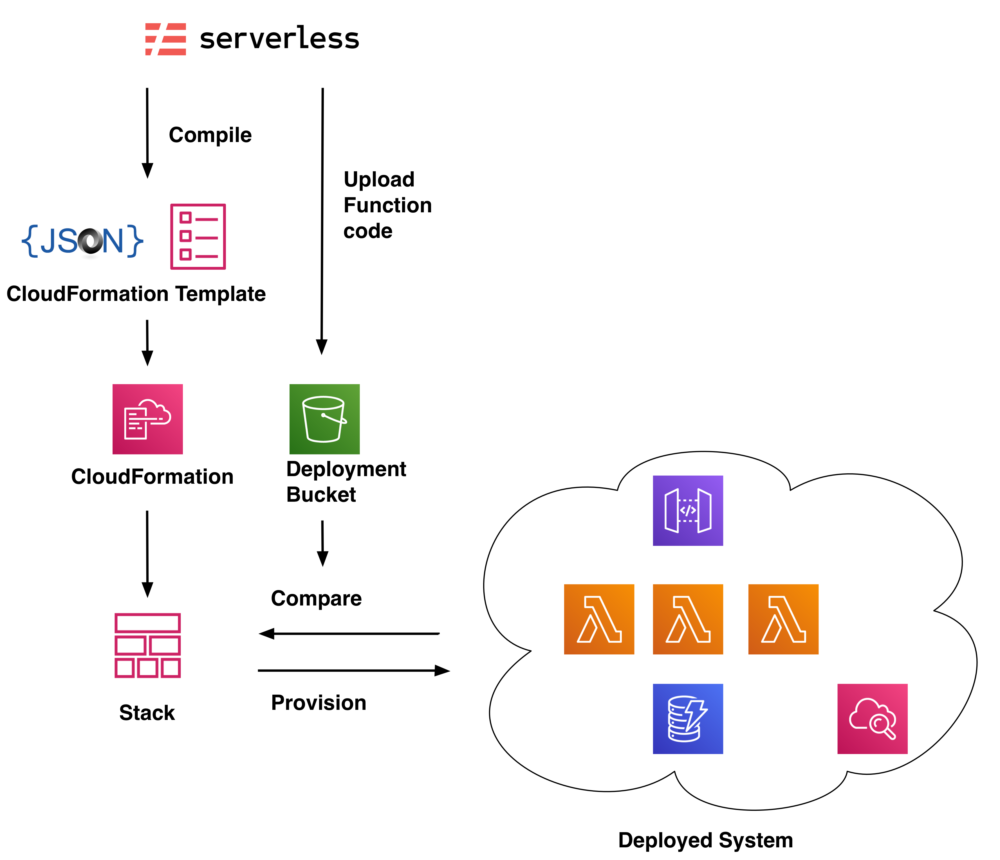

# Cat Detector Step 3 - Serverless
In this workshop we will be using the serverless framework to deploy our system. In this step we will take a quick look under the hood.

Firstly we should note that there are a growing number of tools to help manage serverless infrastrucutre as code. These include:

* AWS SAM
* AWS Amplify
* Hasicorp Terraform
* AWS Cloud Development Kit (CDK)

All of these are very capable tools, and generally under the hood they use AWS Cloud Formation as the main deployment engine.

Whilst it is possible to use Cloud Formation directly with JSON or YAML templates, things do tend to be a bit verbose which is why it makes sense to use a higher level tool to control your deployments. 

## Serverless Framework under the hood
Whilst the Serverless Framework can be used to deploy any AWS resources, it is oriented toward managing and deploying serverless web applications. Typically this means API Gateway, Lambda functions, and database resources such as DynamoDB tables. The Serverless configuration file can be thought of as a lightweight domain-specific language (DSL) that describes these types of applications.

The image below depicts how the framework interacts with cloud formation:



On deployment, the Serverless configuration file (serverless.yml) is "`compiled`" into a CloudFormation template. A deployment bucket is created, and code artifacts for each of the defined Lambda functions are uploaded. Hashes are computed for each of the Lambda functions and included in the template. Serverless then calls the CloudFormation `UpdateStack` method to delegate the deployment work to CloudFormation. CloudFormation then proceeds to query the existing infrastructure. Where differences are found, for example if a new API Gateway route has been defined, CloudFormation will make the required infrastructure updates to align the deployment with the new compiled template.

A minimal serverless configuration file is shown below:

```yaml
service: hello-service

provider:
  name: aws
  runtime: nodejs12.x
  stage: dev
  region: eu-west-1

functions:
  hello:
    handler: handler.hello
    events:
      - http:
          path: say/hello
          method: get
```

This configuration is comprised of three sections defines a single lambda function that will be accessed by a http get request. The provider section defines the cloud as AWS and the runtime as node 12.x.

A minimal example handler function is shown in the listing below:

```javascript
module.exports.hello = async event => {
  return {
    statusCode: 200,
    body: JSON.stringify({
      message: 'Hello!',
      input: event
    },
    null, 2)
  }
}
```

This simply responds to a http `GET` request with the string `Hello!`.

Don't worry if you're new to Serverless, by the end of this workshop you will have deployed a fully working system. Let's move onto step 4 and deploy our first piece of infrastructure.
